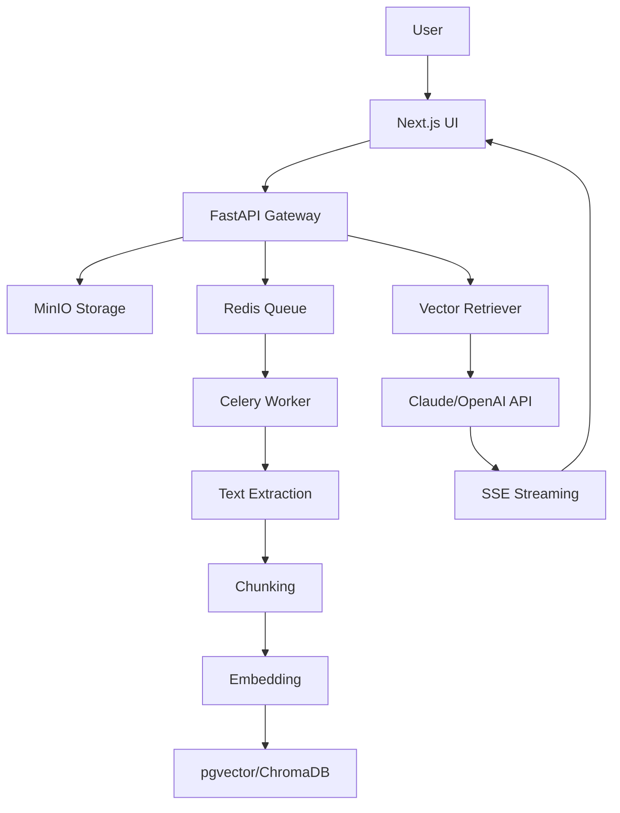

# AI RAG Assistant

<p align="center">
  
  
  
  
  
  <br>
  <a href="#deployment"></a>
  <a href="https://github.com/anoliz13/ai-rag-assistant/actions"></a>
</p>

Production-grade **Retrieval-Augmented Generation** assistant built with **FastAPI**, **LangChain**, **Next.js 14**, and **Claude/OpenAI APIs**.

> Upload documents (PDF, DOCX, TXT, CSV, Markdown), ask questions in natural language, and get AI-powered answers with source citations.

---

## Demo

> **Live Demo:** [Coming soon — deploy to Railway to get your URL]

<!--
TODO: Replace the placeholders below with actual screenshots/GIFs
      See `docs/screenshots/README.md` for details.
      Capture using: https://www.screentogif.com/ or similar tool
-->

<p align="center">
  
  <br>
  <em>RAG chat with source citations — replace with your own screenshot.</em>
</p>

### Features Overview

| Feature | Description |
|---------|-------------|
| 📄 Upload | PDF, DOCX, TXT, CSV, Markdown |
| 🔍 RAG Chat | Q&A with source citations |
| ⚡ Streaming | Real-time SSE responses |
| 🗃️ Document Manager | List, search, preview, delete |
| 💬 Chat History | Sessions, rename, export |
| ⚙️ Admin | API keys, chunk config |

---

## Architecture



## Features

- **Document Upload & Processing**: PDF, DOCX, TXT, CSV, Markdown — auto-extract, chunk, embed
- **RAG Chat**: Q&A over documents with source citations and streaming responses
- **Document Management**: List, search, preview, delete documents
- **Chat History**: Persistent sessions, rename, export to PDF/Markdown
- **Admin Settings**: API key management, chunk config, embedding model, system prompt

## Quick Start

```bash
make up        # Start all services
make migrate   # Run database migrations
make seed      # Upload sample documents
```

Open http://localhost:3000 for the UI, http://localhost:8000/docs for API docs.

## Tech Stack

| Layer | Technology |
|-------|-----------|
| Backend | Python FastAPI, LangChain, Celery |
| Frontend | Next.js 14, TypeScript, Tailwind CSS |
| Vector Store | pgvector (PostgreSQL) / ChromaDB |
| LLM | Anthropic Claude + OpenAI (fallback) |
| Embedding | OpenAI / all-MiniLM-L6-v2 |
| Message Queue | Redis + Celery |
| File Storage | MinIO (S3-compatible) |
| Container | Docker Compose |

## API Endpoints

| Endpoint | Method | Description |
|----------|--------|-------------|
| `/api/documents/upload` | POST | Upload document |
| `/api/documents` | GET | List all documents |
| `/api/documents/:id` | GET | Document details |
| `/api/documents/:id` | DELETE | Delete document |
| `/api/documents/:id/status` | GET | Processing status (WebSocket) |
| `/api/chat` | POST | Ask question (SSE stream) |
| `/api/sessions` | GET | List chat sessions |
| `/api/sessions` | POST | Create session |
| `/api/sessions/:id` | PUT | Rename session |
| `/api/sessions/:id` | DELETE | Delete session |
| `/api/sessions/:id/messages` | GET | Get messages |
| `/api/sessions/:id/export` | GET | Export chat |

## Sample Queries

Upload "Financial Report 2025.pdf" and ask:

- "What was the total revenue for 2025?"
- "Which business segment had the highest growth?"
- "Compare net profit between Q1 and Q4 2025"

## Environment Variables

| Variable | Description | Default |
|----------|-------------|---------|
| `ANTHROPIC_API_KEY` | Claude API key | - |
| `OPENAI_API_KEY` | OpenAI API key (fallback) | - |
| `DATABASE_URL` | PostgreSQL connection | `postgresql+asyncpg://...` |
| `REDIS_URL` | Redis connection | `redis://redis:6379/0` |
| `MINIO_*` | MinIO credentials | - |
| `CHUNK_SIZE` | Text chunk size | `1000` |
| `CHUNK_OVERLAP` | Chunk overlap | `200` |

## Local Development

```bash
docker compose up -d        # Start all services
make migrate                # Run database migrations
make seed                   # Upload sample documents
```

Open http://localhost:3000 for the UI, http://localhost:8000/docs for API docs.

Scale workers locally: `docker compose up -d --scale worker=3`

## Production

```bash
cp .env.railway .env.production
# Edit .env.production with real secrets
docker compose -f docker-compose.prod.yml up -d
```

Differs from local dev:
| Aspect | Local (`docker-compose.yml`) | Production (`docker-compose.prod.yml`) |
|--------|------------------------------|----------------------------------------|
| Hot reload | Yes | No |
| Volume mounts | Source code mounted | Named volumes only |
| `restart` | No | `always` |
| Resource limits | None | CPU/memory limits |
| Env file | `.env` | `.env.production` |

## Deploy to Railway

This project is configured for easy deployment on [Railway](https://railway.app).

### One-click Deploy

[](https://railway.app/template/ai-rag-assistant)

### Via Railway CLI

```bash
# 1. Install CLI & login
npm install -g @railway/cli
railway login

# 2. Create project
railway init

# 3. Add plugins
railway plugin install postgresql
railway plugin install redis

# 4. Deploy services
railway up --service backend    # deploy backend/
railway up --service frontend   # deploy frontend/

# 5. Set environment variables
railway variables set SECRET_KEY=$(openssl rand -hex 32)
railway variables set ANTHROPIC_API_KEY=sk-...
railway variables set MINIO_ENDPOINT=...
# ... set all vars from table below

# 6. Open dashboard
railway open
```

### Manual Setup via Dashboard

1. **Fork this repo** to your GitHub account.
2. **Create a Railway project** and add these services:

| Service | Root Directory | Type | Notes |
|---------|---------------|------|-------|
| Backend | `backend` | Web service | FastAPI + Celery |
| Frontend | `frontend` | Web service | Next.js |
| PostgreSQL | — | Plugin | Railway managed |
| Redis | — | Plugin | Railway managed |
| MinIO | — | Plugin or external S3 | For file storage |

3. **Set environment variables** in each service:

#### Backend Environment Variables

| Variable | Required | Description |
|----------|----------|-------------|
| `ANTHROPIC_API_KEY` | Yes | Claude API key |
| `OPENAI_API_KEY` | No | OpenAI fallback |
| `DATABASE_URL` | Auto | Set by Railway PostgreSQL plugin |
| `DATABASE_URL_SYNC` | Auto | Set by Railway PostgreSQL plugin |
| `REDIS_URL` | Auto | Set by Railway Redis plugin |
| `SECRET_KEY` | Yes | Change for production |
| `MINIO_ENDPOINT` | Yes | MinIO server endpoint |
| `MINIO_ACCESS_KEY` | Yes | MinIO access key |
| `MINIO_SECRET_KEY` | Yes | MinIO secret key |
| `MINIO_BUCKET` | Yes | MinIO bucket name |
| `ENVIRONMENT` | No | `production` |
| `LLM_PROVIDER` | No | `claude` (default) |
| `LLM_MODEL` | No | `claude-sonnet-4-20250514` |

#### Frontend Environment Variables

| Variable | Required | Description |
|----------|----------|-------------|
| `NEXT_PUBLIC_API_URL` | Yes | Backend URL (e.g. `https://backend-xxx.up.railway.app`) |
| `NEXT_PUBLIC_WS_URL` | Yes | WebSocket URL (e.g. `wss://backend-xxx.up.railway.app`) |

4. **Railway will auto-deploy** on every push to `main`.

### Health Check

Backend exposes a health endpoint at `/health`:
```json
{"status": "ok", "service": "ai-rag-assistant", "version": "1.0.0"}
```

---

## License

MIT
