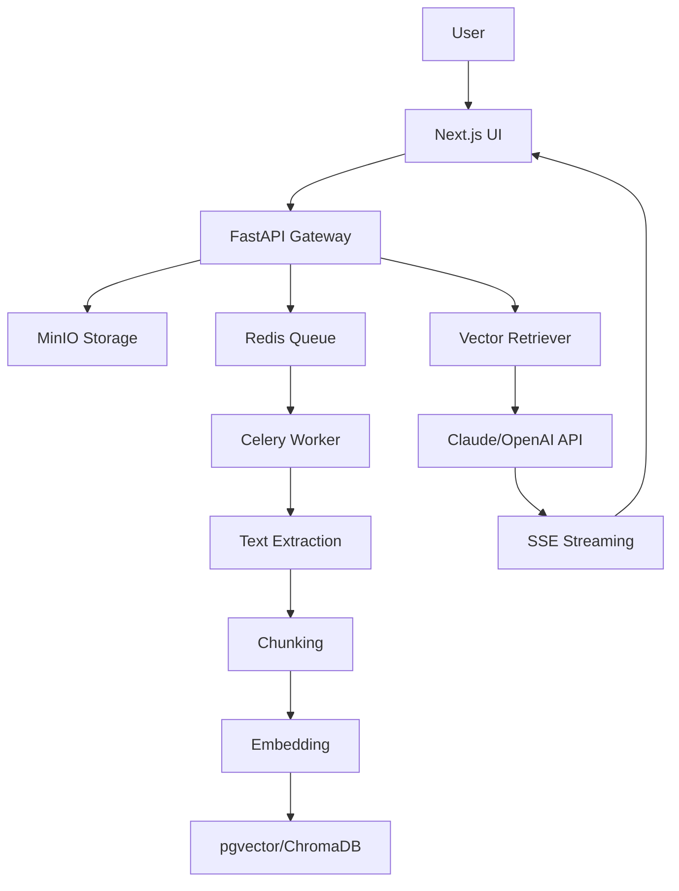

# AI RAG Assistant

Production-grade **Retrieval-Augmented Generation** assistant built with **FastAPI**, **LangChain**, **Next.js 14**, and **Claude/OpenAI APIs**.

> Upload documents (PDF, DOCX, TXT, CSV, Markdown), ask questions in natural language, and get AI-powered answers with source citations.

## Architecture



## Features

- **Document Upload & Processing**: PDF, DOCX, TXT, CSV, Markdown — auto-extract, chunk, embed
- **RAG Chat**: Q&A over documents with source citations and streaming responses
- **Document Management**: List, search, preview, delete documents
- **Chat History**: Persistent sessions, rename, export to PDF/Markdown
- **Admin Settings**: API key management, chunk config, embedding model, system prompt

## Quick Start

```bash
make up        # Start all services
make migrate   # Run database migrations
make seed      # Upload sample documents
```

Open http://localhost:3000 for the UI, http://localhost:8000/docs for API docs.

## Tech Stack

| Layer | Technology |
|-------|-----------|
| Backend | Python FastAPI, LangChain, Celery |
| Frontend | Next.js 14, TypeScript, Tailwind CSS |
| Vector Store | pgvector (PostgreSQL) / ChromaDB |
| LLM | Anthropic Claude + OpenAI (fallback) |
| Embedding | OpenAI / all-MiniLM-L6-v2 |
| Message Queue | Redis + Celery |
| File Storage | MinIO (S3-compatible) |
| Container | Docker Compose |

## API Endpoints

| Endpoint | Method | Description |
|----------|--------|-------------|
| `/api/documents/upload` | POST | Upload document |
| `/api/documents` | GET | List all documents |
| `/api/documents/:id` | GET | Document details |
| `/api/documents/:id` | DELETE | Delete document |
| `/api/documents/:id/status` | GET | Processing status (WebSocket) |
| `/api/chat` | POST | Ask question (SSE stream) |
| `/api/sessions` | GET | List chat sessions |
| `/api/sessions` | POST | Create session |
| `/api/sessions/:id` | PUT | Rename session |
| `/api/sessions/:id` | DELETE | Delete session |
| `/api/sessions/:id/messages` | GET | Get messages |
| `/api/sessions/:id/export` | GET | Export chat |

## Sample Queries

Upload "Financial Report 2025.pdf" and ask:

- "What was the total revenue for 2025?"
- "Which business segment had the highest growth?"
- "Compare net profit between Q1 and Q4 2025"

## Environment Variables

| Variable | Description | Default |
|----------|-------------|---------|
| `ANTHROPIC_API_KEY` | Claude API key | - |
| `OPENAI_API_KEY` | OpenAI API key (fallback) | - |
| `DATABASE_URL` | PostgreSQL connection | `postgresql+asyncpg://...` |
| `REDIS_URL` | Redis connection | `redis://redis:6379/0` |
| `MINIO_*` | MinIO credentials | - |
| `CHUNK_SIZE` | Text chunk size | `1000` |
| `CHUNK_OVERLAP` | Chunk overlap | `200` |

## Deployment

```bash
docker compose build
docker compose up -d
```

Scale workers: `docker compose up -d --scale worker=3`

## License

MIT
